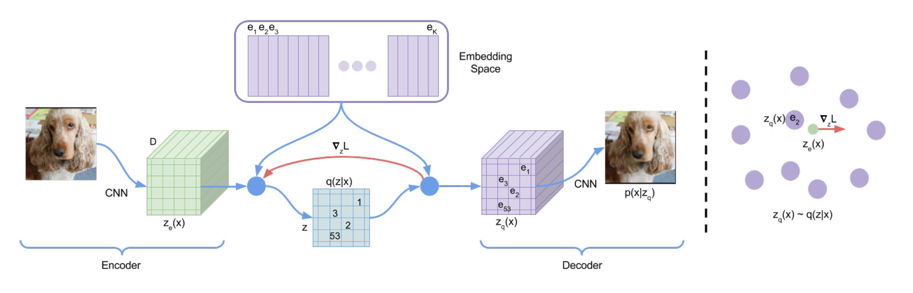
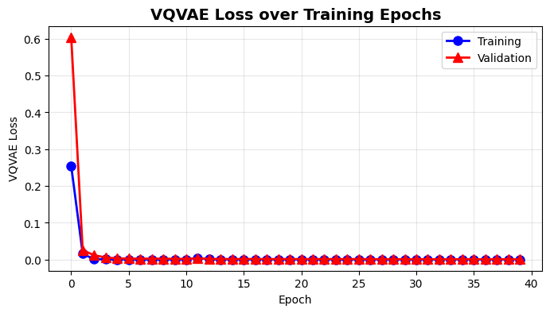
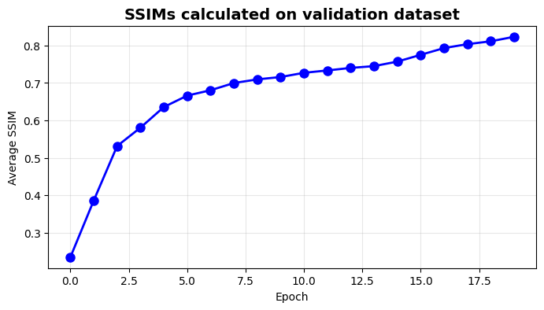
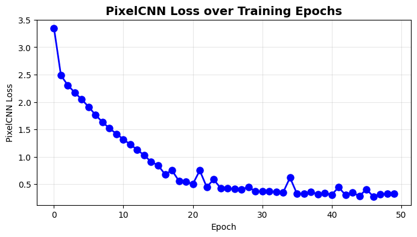
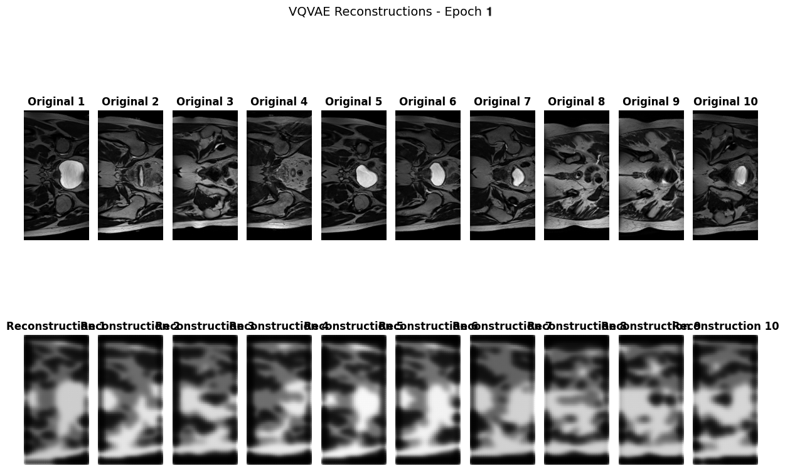
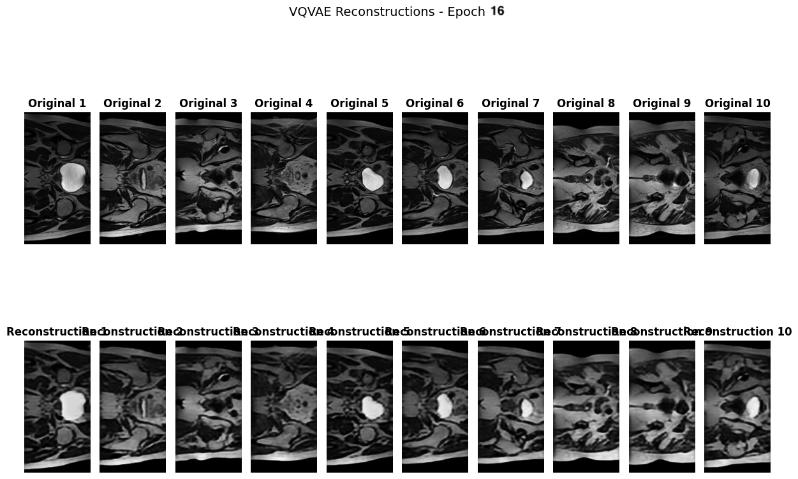
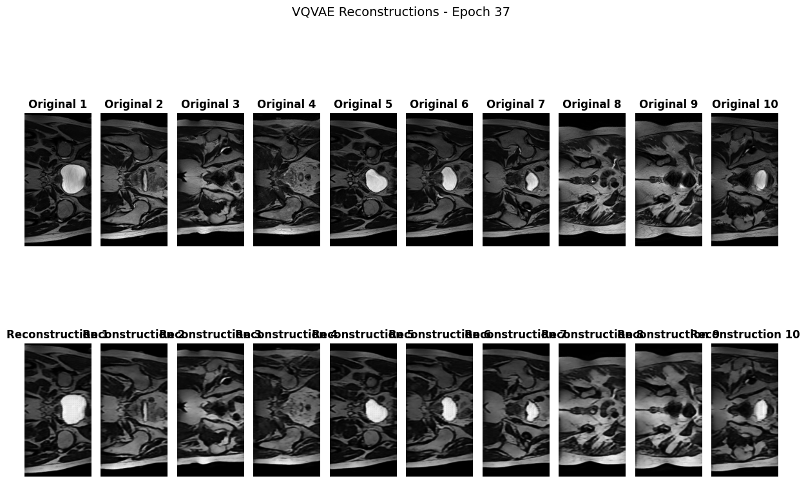
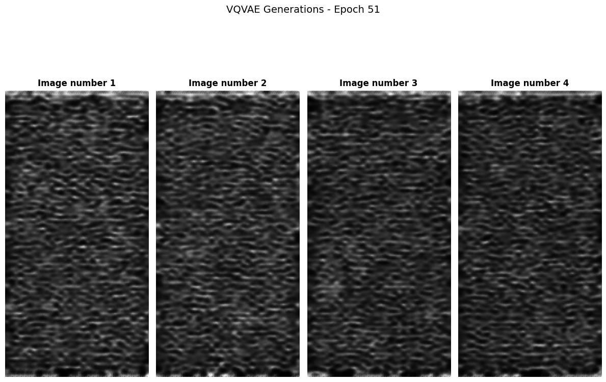

# VQVAE for HipMRI Image Reconstruction and Generation

The objective of this project was to solve a recognition problem using a deep learning method. This folder includes the solution and scripts for implementing the topic number 10 of the COMP3710 Project.

Description:
"Create a generative model of the HipMRI Study on Prostate Cancer using the processed 2D slices (2D images) available here with the using a VQVAE or VQVAE2 that has a “reasonably clear image” and a Structured Similarity (SSIM) of over 0.6."

This README contains a summary of the results and model, essentially as a mini-report.

## Project Overview

This project aims to implement a VQVAE (as described in [1]) to perform image reconstruction of HipMRI images. 

## Dependencies 

Outlined here are the versions used within this VQVAE implementation, and their dependencies.

*Table 1*:
| Package | Version | Dependencies, if applicable | Usage |
|---|---|---|---|
| python | v3.13.7 | - | - |
| scikit-image | v0.25.2 | numpy>=1.24, scipy>=1.11.4, networkx>=3.0, pillow>=10.1, imageio!=2.35.0,>=2.33, tifffile>=2022.8.12, packaging>=21, lazy-loader>=0.4| SSIM metric |
| tqdm | v4.67.1 | - | Load data function. Progress bars for training loops. |
| nibabel | v5.3.2 | numpy>=1.22, packaging>=20 | Load data function. |
| numpy | v2.1.2 | - | Load data function, linear algebra. |
| packaging | v25.0 | - | - |
| torch | v2.7.1+cu118 | - | Deep learning model. |
| openssl | v3.0.18 | - | tqdm | 
| matplotlib | v3.10.6 | - | Plotting and visualisations. |
| utils | v1.0.2 | - | to_channels function |

## Hyperparameters

*Table 2*:
| Name | Chosen number for project | Description | Other comments |
|---|---|---|---|
| num_embeddings | 256 | The number of embedding vectors (K) to be used in the codebook. | A larger K leads to increased capacity in the information bottleneck. |
| embedding_dim | 32 | The dimensionality D of each embedding vector. | D does not change the capacity in the information bottleneck. |
| commitment_cost | 0.5 | The weighting factor (beta) for the commitment loss term. | Load data function. Progress bars for training loops. |
| num_resid_layers | 3 | The number of residual layers in the encoder/decoder residual stacks. | A greater reconstruction quality may be obtained with a larger number. |
| num_hidden | 128 | Number of channels in the hidden layers of the encoder/decoder. Defines dimensionality of the feature maps and controls the size of the intermediate representations. | A greater reconstruction quality may be obtained with a larger number. |
| num_resid_hiddens | 64 | Number of channels in the hidden layers of each residual block. | - |
| learning_rate | 1e-4 | Learning rate parameter for Adam optimiser. | - |
| batch_size | 32 | Chosen number of images to be processed/utilised at once by the DataLoader. | - |
| num_epochs | 20 | Number of epochs to run the VQVAE training for. | - |
| num_epochs_pixelCNN | 50 | Number of epochs to run the PixelCNN training for. | - |

## Description of the Model - VQVAE and PixelCNN

Overall, a VQVAE aims to address the 'posterior collapse' problem that may occur in traditional Variational Auto-Encoders (VAEs) by allow a learnt representation of discrete embeddings, rather than modelling a continuous latent space [1]. There are two components to the project overall: the VQVAE, and the PixelCNN which functions as an autoregressive prior to enable image generation [1]. 

A high-level overview of the architecture of the VQVAE, and each component, is provided here:

Each component functions as follows:

### Encoder

An encoder network outputs discrete codes/embeddings. Similar to a traditional encoder, it functions by taking in the image input data $x$, and through a series of convolutional sampling, results in a different representation by extracting features from the input data. To increase accuracy, this encoder implements residual connections through the use of residual blocks. The encoder makes use of residual stacks, which are a series of residual blocks (the number of which is given by num_resid_layers). This project's implementation of the encoder consists of two convolutional layers with a kernel size of 4x4, each followed by a ReLU activation, and then an additional convolution layer with a 3x3 kernel followed by a residual stack. 

### Vector Quantiser

The Vector Quantiser helps to represent the discrete latent space that is learnt by the VQVAE and that can capture important features of the data in an unsupervised manner. Outputs $z_e(x)$ from the encoder are entered into the vector quantiser, which then uses a nearest neighbour lookup to identify the closest embedding vector within the space. The latent embedding space is of dimension $\mathbb{R}^{K \times D}$ where $K$ is the size of the latent space (i.e., the number of embeddings), and $D$ is the dimensionality of each embedding vector (i.e., the embedding dimensions). 
Embeddings are represented by the class nn.Embedding, which functions as a simple lookup table that maps an index value to a weight matrix. During training, the parameters of this embedding layer are adjusted, with the embedding matrix (also known as codebook) being updated via backpropagation to minimise the loss function. Embedding weights were initialised using a uniform distribution, to avoid starting with any bias. 

### Decoder

As input, the decoder takes $z_q(x)$, the embedding vector identified by the vector quantiser. Through another series of convolutions, the input is sampled until the final output is produced. Similar to the encoder, residual connections are implemented through the use of stacks of residual blocks. A final sigmoid activation function was utilised as the final layer of the decoder. This is to maintain consistency with the data pre-processing that was utilised; as datasets were standardised to be in [0,1] (which is the range of nn.Sigmoid()).

### Vector Quantiser prior - PixelCNN

The prior $p(z)$ in the VQVAE case is learnt rather than static, and it is trained over the discrete latent space. In the original VQVAE implementation, an autoregressive prior (PixelCNN) was used [1]. The purpose of training a 'prior' distribution is to enable generation, once the discrete latent structure has been learnt by the VQVAE [1].

### PixelCNN

The PixelCNN is a model that learns to model the prior, and is used for generation. For image generation, it generates every new pixel sequentially, one at a time, and on the basis of (conditioned on) previous pixels it has generated [2]. It uses masked convolutions, in order to set connections to any future pixels to zero, such that the model cannot 'see' these. Two different types of masks are implemented in the PixelCNN class - these include mask 'A' which is utilised for the very first layer and masks out the current pixel as well as all subsequent pixels, and mask 'B' for all subsequent layers, which zeros out all future pixels but not the current pixel.
To sample from the latent space, the trained PixelCNN is fit over the latent values. The PixelCNN returns probabilities for each pixel.

### Loss

The VQVAE loss is composed of three components, which each have their own interpretation and effect [1]. The first term is the reconstruction loss, which optimises the decoder and the encoder and measures the fidelity of codebook reconstructions. The second term is the codebook loss, which uses the l2 error to move the embedding vectors towards the encoder outputs. The final term is commitment loss. By pushing the encoder to commit to an embedding, it is used to ensure that the volume of the embedding space does not grow arbitrarily. 

$$ L_{VQVAE} = \log p(x | z_q(x)) + \lvert \text{sg}[z_e(x)] - e\rvert_2^2 + \beta \lvert z_e(x) - \text{sg}[e] \rvert_2^2$$

*Equation: Full loss term for the VQVAE. sg indicates the stop-gradient operator, which functions to constrain its operand to be a non-updated constant. Absolute value bars indicate Euclidian norm.*

In terms of measuring reconstruction fidelity, the Structural Similarity Index (SSIM) was used. This is a framework for assessing the similarity and visibility of differences between a 'distorted' image and a reference image, based on the degradation of or change in structural information [3]. It holds a benefit over other metrics as it takes texture and structural information into account, and incorporates perceptual phenomena such as luminance and contrast [3]. In the case of this project, the SSIM is measured in reference to the original uncompressed/unedited HipMRI image. 

For PixelCNN training, the cross-entropy loss was used, as the pixel 'classification' is considered a multi-class problem. 

### Optimiser, and optimisation process

The optimisation process utilises the Straight Through Estimator trick [4], which is implemented as part of the VectorQuantiser forward pass. As the latent space is discretised, gradients are not well-defined and so the backpropagation of gradients may fail. This step is required to allow backpropagation, by allowing the gradients to pass directly from the decoder input to the encoder output, skipping the non-differentiable vector-quantised component. 

The optimiser of choice was the Adaptive Moment Estimator (Adam) [5] for both the VQVAE and PixelCNN, due to its computational efficiency and favourable performance. It combines an adaptive learning rate with momentum. 

## Data & Preprocessing

Data are of HipMRI images of the male pelvis, available in Nifti file format [6]. They were acquired through a MRI-alone radiation therapy study conducted at the Calvary Mater Newcastle Hospital over 2014 [7]. 
In this project, normalisation was performed by standardising each image such that each pixel value falls in [0,1]. It was decided to not standardise each image to a mean of 0 and standard deviation of 1, because upon inspection, the pixel values for each image clearly did not appear normally distributed (on the contrary, they appeared quite non-normal and skewed to the right). This standardisation was carried out on a global basis (using the global max value for standardisation) rather than on a per-image basis. This is because upon inspection, there was a large degree of variation between pixel max values for each image. Additionally, the standardisation was conducted separately across each split of data (train/test/validate), so as to ensure that scaling parameters such as min/max are not mixed between training and test sets (and therefore, to minimise data leakage [8]). 

The train/test/validate split was as follows: 
*Table 3*:
| Section | Number of Images | Proportion of Total Images |
|---|---|---|
| Train | 11,460 | 11460/(11460+540+660) = 90.52% |
| Test | 540 | 540/(11460+540+660) = 4.27% |
| Validate | 660 | 660/(11460+540+660) = 5.21% |

These were the default provided train/test/validation splits within the native data directory on the Rangpur cluster. Each image is of size (256x128). There were however, 60 images within the training dataset that were inconsistent with these dimensions. These were removed and not implemented in the training of the model, owing to the fact that they constitute a very small proportion of the total test size, and also to avoid any unwanted artefacts being introduced with the re-sizing of these images. 

This project utilised unsupervised learning and did not solve a classification problem, as there were no classes or labels in the available data. Therefore, the potential problem of class imbalance was not relevant, and there was no need to consider an alternative train/test split. 

## Usage

Prerequisites for usage: 
* a GPU-enabled hardware or environment, e.g. a HPC cluster
* a suitable Python environment to meet the package dependencies and versioning listed above, in *Table 1*. 

How to run:
- Adjust parameters in `config.py` if necessary. Set `plot_metrics` parameter to True if you wish to visualise reconstructions and plot losses, SSIMs etc. during/after training. All hyperparameters from `config` are imported into the relevant scripts. 
- Run `python predict.py` to run the model. This script also runs `train.py`, and so completes training prior to evaluating model performance on the test set.

The particular implementation of this project that is shared in this README was run on the Rangpur cluster, using an Nvidia A100 GPU for computations. Data is located in the following directories: 

Table 4:
| Dataset | Directory |
|---|---|
| Train | "/home/groups/comp3710/HipMRI_Study_open/keras_slices_data/keras_slices_train" |
| Test | "/home/groups/comp3710/HipMRI_Study_open/keras_slices_data/keras_slices_test" |
| Validate | "/home/groups/comp3710/HipMRI_Study_open/keras_slices_data/keras_slices_validate" |

The script works with the absolute paths for the data directories, and so does not rely on the data folders being set up in a specific location relative to the working directory. 
Any plots, visualisations, or reconstructions are not shown in-editor, but are saved to a specified directory. For this project, "/home/Student/s4532467/plots" was used.

If you wish to run the script with a different dataset, you will need to modify the data directories in `dataset.py`, modify the number of channels in `config`, and potentially, evaluate what different pre-processing, standardisation, and train/test splitting is required for your specific problem and data. 

## Results

### Training / Loss Curves

The loss was evaluated using SSIM (structured similarity index) [3], as well as the VQVAE loss. During training, loss was evaluated on both the training dataset and the validation set. 
Plots indicate that training and validation loss for the VQVAE decrease with more epochs. The validation loss starts out higher than the training loss, which is to be expected, but then they approach each other. The validation loss also does not start to overtake the training loss, which is a good indicator that the model is not overfitting. 

The SSIM, when evaluated comparing the original image with the reconstruction, achieved an SSIM > 0.6 as early as Epoch 5, then continued increasing but appears to plateau at an SSIM sitting roughly above 0.8. On Epoch 40, the final SSIM was 0.8644 (calculated on the validation dataset), and the test SSIM was 0.88. 

PixelCNN loss was evaluated on the training dataset. Loss appeared to converge at a slower rate for the PixelCNN than for the VQVAE model, however, there was still a continuous decrease and what appeared to be a plateau in the rate of decrease at around epoch 30-50. The final PixelCNN training loss was 0.3722 on Epoch 50, and the final testing loss was evaluated to be 0.744. 

### Result Demonstration 

In this section, the results of the reconstruction and generation will be shared.

#### Reconstruction

The VQVAE model succeeded in generating high-quality, reasonably clear reconstructions. Between the original image and the reconstructed one, there is clearly still some degree of blurring, but overall the image was clearly comparable to the original. All components of the image appeared in their expected locations, with consistency in brightness, texture, and scale between the two. Early reconstructions (around Epoch 1) were understandably poor, but the quality continuously improved. 
The top row of these images display the original data inputs, i.e. the original HipMRI images. The bottom row displays the corresponding VQVAE-reconstructed image.

#### Generation

Generation was completed by pairing the trained VQVAE model with an autoregressive prior (PixelCNN), as described in [1]. While reconstructions produced high-fidelity images, the image generation via sampling from the latent space was much less successful. Images were blurred with a high degree of static, and did not particularly resemble an MRI image at any point. 

For other generations, see here:
[Epoch1](plots/VQVAE_gen_epoch1.png), 
[Epoch10](plots/VQVAE_gen_epoch10.png)

## Other notes/assumptions
To address data leakage, I have assumed that individuals were *not* repeated across the training, test, and validation sets. I.e., the individuals that constitute the training set are completely independent of the individuals that constitute the testing/validation set, and there are no images in the test/validation set that are of individuals that also appeared in the training set. This would constitute a large data leakage risk and may lead to overestimation of accuracy, even if the images themselves are different. 

## References

[1]: A. van den Oord, O. Vinyals, and K. Kavukcuoglu, (2017), "Neural Discrete Representation Learning". arXiv:1711.00937

[2]: A. van den Oord, N. Kalchbrenner, O. Vinyals, L. Espeholt, A. Graves, and K. Kavukcuoglu, (2016), "Conditional Image Generation with PixelCNN Decoders". arXiv:1606.05328

[3]: Z. Wang, A. C. Bovik, H. R. Sheikh and E. P. Simoncelli, (2004), "Image quality assessment: from error visibility to structural similarity". IEEE Transactions on Image Processing, 13(4), pp. 600-612.

[4]: Y. Bengio, N. Léonard, and A. Courville, (2013), "Estimating or propagating gradients through stochastic neurons for conditional computation". arXiv:1308.3432

[5]: D. P. Kingma, J. Ba, (2014), "Adam: A Method for Stochastic Optimization". arXiv:1412.6980

[6]: J. Dowling, and P., Greer, (2021), "Labelled weekly MR images of the male pelvis". v2. CSIRO. Data Collection. https://doi.org/10.25919/45t8-p065

[7]: J. Dowling, J. Sun, P. Pichler, D. Rivest-Hénault, S. Ghose, H. Richardson, C. Wratten, J. Martin, J. Arm, L. B, S. Chandra, J. Fripp, F. Menk, P. Greer, (2015), "Automatic Substitute Computed Tomography Generation and Contouring for Magnetic Resonance Imaging (MRI)-Alone External Beam Radiation Therapy From Standard MRI Sequences". International Journal of Radiation Oncology, Biology, Physics, 93(5), pp. 1144-1153.

[8]: S. Kapoor, A. Narayanan, (2023), "Leakage and the reproducibility crisis in machine-learning-based science". Patterns, 4(9), 100804.

